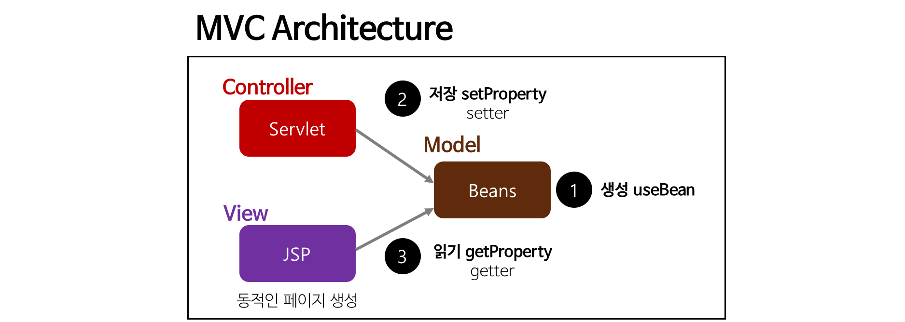

# Today I Learn
## 목표
* 공부한 내용 기록
* 2문제 이상 알고리즘 문제 풀기

## 6月

### 4日

- JSP(Java Server Page)

    - Java 언어를 기반으로 하는 Server Side 스크립트 언어
    - HTML 코드에 Java 코드를 넣어 동적인 웹 페이지를 생성하는 웹 어플리케이션 도구
    - Servlet를 보완한 스크립트 방식으로 Servlet의 모든 기능을 사용 가능
    - 동작 과정
        1. JSP가 실행되면 WAS는 내부적으로 JSP 파일을 Java Servlet으로 변환
        2. WAS는 이 변환한 Servlet을 동작하여 필요한 기능을 수행
        3. 수행 완료 후 생성된 데이터를 웹 페이지와 함께 클라이언트로 응답
    - 생명주기
        - Servlet 생명주기와 유사하다.   
        
    - 문법
        1. JSP Expression   
            **<%= expression %>**  
            JSP Expression element는 String으로 변환되어 Servlet의 출력에 삽입되며 동적인 페이지를 생성하고 끝에 세미콜론(;)을 붙이지 않는다
        2. JSP Scriptlet   
            **<% code fragment %>**   
            간단한 값이 아닌 복잡한 것을 수행하고자 할 때 사용한다   
            임의의 Java 코드를 삽입할 수 있으며 JSP Scriptlet Tag는 메소드가 아닌 변수만 선언할 수 있다
        3. JSP Declaration   
            **<%! declaration %>**   
            JSP Declaration을 사용하면 Servlet 클래스에 삽입되는 메소드나 필드를 정의할 수 있다
        4. JSP Comment   
            **<%-- comment --%>**   
            주석 기능
        5. JSP Directive   
            **<%@ directive %>**   
            JSP 페이지의 전체적인 구조에 영향을 미친다   
            전체 구조에 대해 WAS에 지시를 내리며 지시어에는 page, include, taglib가 들어간다   
               1. page    
               **<%@ page attribute = "value" %>**   
               - page 지시어는 Container에 명령을 제공하는데 사용된다   
               2. include   
               **<% include file = "relative_url" %>**   
               - include 지시어는 변환 단계에서 다른 외부 파일의 내용을 현재 JSP에 병합하도록 Container에 지시한다   
               - 웹 페이지에서 header와 footer의 구성은 거의 동일하기 때문에 외부에서 형식을 만든 후 include 지시어를 이용하여 main.jsp에 병합한다   
               3. taglib   
               **<% taglib uri = "uri" prefix = "prefixOfTag" %>**   
               - JSP API를 사용하면 HTML 또는 XML 태그처럼 보이는 사용자 정의 태그를 정의할 수 있다   
               - tag library는 사용자가 정의한 동작을 구현한 사용자 정의 태그 집합이다
        6. JSP Action   
            JSP Action XML 구문 안의 구조들을 사용하여 WAS의 동작을 제어한다   
               1. **< jsp:forward >** action   
               - 다른 리소스(JSP, html 또는 Servlet과 같은 정적 페이지)로 요청을 전달하는데 사용한다   
               2. **< jsp:include >** action   
               - 현재 JSP 페이지에 다른 리소스를 포함시키는데 사용한다
               3. **< jsp:useBean >** action   
               - 해당하는 Bean(자바 객체)이 존재하는지 확인하고 없으면 지정된 객체를 생성한다   
               4. **< jsp:setProperty >** action   
               - Bean의 속성을 설정한다   
               5. **< jsp:getProperty >** action   
               - 주어진 속성값을 가져오는데 사용되며 이를 문자열로 변호나하고 동적인 웹 페이지를 생성하는데 해당 내용을 사용할 수 있다
    - 호출 방법 (아래로 갈수록 복잡한 App 또는 큰 규모의 개발팀이 사용)
        1. Call Java code Directly
            - 모든 Java 코드를 JSP 페이지에 넣는 방식으로 아주 적은 양의 코드에만 적합한 전략
        2. Call Java code indirectly
            - 별도의 utility class를 작성하고 호출하는 데 필요한 Java 코드만 JSP 페이지에 넣는다
        3. Use beans
            - beans로 구조화된 별도의 utility class를 작성한 후 jsp:useBean, jsp:getProperty, jsp:setProperty를 사용하여 uility class를 호출한다
        4. Use the MVC architecture
            - Servlet(Controller)이 요청에 응답하고 적절한 데이터를 검색하여 결과를 beans(Model)에 저장하고 결과를 JSP 페이지(View)로 전달하여 결과를 표시한다
            
        5. Use the JSP expression Language
            - shorthand syntax를 이용하여 간단하게 객체 속성에 접근하고 출력한다
            - jsp:useBean, jsp:getProperty, jsp:setProperty를 expression language로 간단하게 표현할 수 있다
            - 일반적으로  beans, MVC 패턴을 함께 사용
        6. Use custom tags
            - tag handler class를 만들고 XML과 같은 사용자 정의 태그를 사용하여 태그 핸들러를 호출한다
        

### 5日

- 리다이렉트(Redirect)

    - HTTP프로토콜로 정해진 규칙으로 서버는 클라이언트의 요청에 대해 특정 URL로 이동을 요청할 수 있는데 이를 리다이렉트라고 한다
    - 서버는 클라이언트에게 HTTP 상태코드 302로 응답할 때 헤더 내 Location 값에 이동할 URL을 추가하고 응답을 받은 클라이언트는 헤더(Location)에 포함된 URL로 재요청을 보내게 되고 이때 브라우저의 주소창은 새 URL로 바뀌게 된다
    - 클라이언트는 서버로부터 받은 상태 값이 302이면 Location 헤더값으로 재요청을 보내게 되고 이때 브라우저의 주소창은 전송받은 URL로 바뀌게 된다
    - 서블릿이나 JSP는 리다이렉트 하기 위해 HttpServletResponse 클래스의 sendRedirect() 메소드를 사용한다
    

- 포워드(Forward)

    - 웹 컨테이너 차원에서 페이지 이동만 있는 것으로 웹 브라우저는 다른 페이지로 이동을 했는지 알 수 없어 최초에 호출한 URL이 표시된다
    - 클라이언트와 통신 없이 서버에서만 처리되는 것이기 때문에 리다이렉트보다 나은 성능을 보여준다
    - 현재 실행중인 페이지와 포워딩에 의해 호출되는 Request와 Response 객체를 공유하고 객체를 Request에 담아 다음 자원에 전송한다
    

### 7日

- Scope
    
    

    - Application : 웹 어플리케이션이 시작되고 종료될 때까지 변수가 유지되는 경우 사용
    - Session : 웹 브라우저 별로 변수가 관리되는 경우 사용
    - Request : http 요청을 WAS가 받아서 웹 브라우저에게 응답할 때까지 변수가 유지되는 경우 사용
    - Page : 페이지 내에서 지역변수처럼 사용

-  Page Scope

    - PageContext 추상 클래스를 사용하며 JSP 페이지에서 pageContext 내장 객체로 사용 가능
    - forward가 될 경우 해당 Page scope에 지정된 변수는 사용할 수 없다
    - 사용방법은 Application scope나 Session scope, request scope와 같으나 지역변수처럼 사용된다는 것이 다른 scope들과 다르다
    - jsp에서 pageScope에 값을 저장한 후 해당 값을 EL표기법 등에서 사용할 때 사용한다
    - 지역 변수처럼 해당 jsp나 서블릿이 실행되는 동안에만 정보를 유지하고자 할 때 사용한다

- Request Scope

    - http 요청을 WAS가 받아서 웹 브라우저에게 응답할 때까지 변수값을 유지하고자 할 경우 사용한다
    - JSP에서는 request 내장 변수를 서블릿에서는 HttpServletRequest 객체를 사용한다
    - 값을 저장할 때는 request 객체의 setAttribute() 메소드를 읽어 들일 때는 request 객체의 getAttribute() 메소드를 사용한다

- Session Scope

    - 웹 브라우저별로 변수를 관리하고자 할 경우 사용한다
    - 웹 브라우저간의 탭 간에는 세션정보가 공유되기 때문에, 각각의 탭에서는 같은 세션정보를 사용할 수 있다
    - HttpSession 인터페이스를 구현한 객체를 사용하며 JSP에서는 session 내장 변수를 서블릿에서는 HttpServletRequest의 getSession() 메소드를 이용하여 session 객체를 얻는다
    - 값을 저장할 때는 session 객체의 setAttribute() 메소드를 값을 읽어 들일 때는 session 객체의 getAttribute()메소드를 사용한다
    - 장바구니처럼 사용자별로 유지가 되어야 할 정보가 있을 때 사용한다

- Application Scope

    - 웹 어플리케이션이 시작되고 종료될 때까지 변수를 사용할 수 있다
    - ServletContext 인터페이스를 구현한 객체를 사용하며 JSP 에서는 applcation 내장 객체를 서블릿에서는 getServletContext() 메소드를 이용하여 application 객체를 이용한다
    - 웹 어플리케이션 하나당 하나의 application객체가 사용된다
    - 값을 저장할 때는 application객체의 setAttribute()메소드를 값을 읽어 들일 때는 application객체의 getAttribute()메소드를 사용한다
    - 모든 클라이언트가 공통으로 사용해야 할 값들이 있을 때 사용한다
