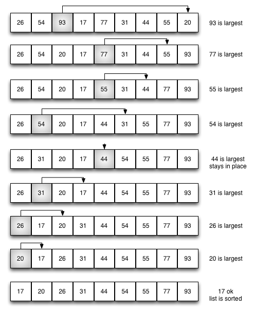

# Self_Study
## 목표
* 공부한 내용 기록
* 2문제 이상 알고리즘 문제 풀기

## 6月

* 11日

-병합정렬(mergeSort) O(n log n)

배열의 크기가 1일 될때까지 절반으로 계속 쪼개어 합칠 때 정렬을 하며, 결과적으로 원래 크기의 배열을 정렬한다.
mergesort인자로는 해당 배열,시작점,배열의 마지막 주소가 필요하며 merge의 인자로는 배열,시작점,끝점,중간점이 필요하다
병합 과정에서는 새로운 배열을 선언하여 정렬이 끝나면 정렬된 배열을 원래의 배열에 붙여넣기해야한다.
과정을 그림으로 나타내면 다음과 같다.


코드는 다음과 같다.
```
mergeSort(*arr, s, d) {
    s==d -> return
    m = (s+d)/2
    mergesort(arr, s, m)
    mergesort(arr, m+1, d)
    merge(arr, s, d, m)
}

merge(*arr, s, d, m) {
    i = s, j = m+1
    k = s ; k to d
    if arr[i]>arr[j]
        tmp[k++] = arr[j]
        j++
    else
        tmp[k++] = arr[i]
        i++
    arr = tmp
}
```

- 선택정렬(selectionSort) O(n^)

크기가 n인 배열을 첨부터 끝까지 접근하여 최대값을 찾아 배열의 n-1의 값이랑 바꾼다. 한번 수행할때마다 1~n-1 , 1~n-2처럼 1씩 줄어들고
n-1번 반복하여 정렬 된다.



코드는 다음과 같다
```
selctionSort(*arr) {
    for i = arr.size - 1 ; i>0 ; j--
        max = arr[0]
        num = 0
        for j = 1 ; j<=i j++
            if arr[j]>max -> max = arr[j], num = j
        swap(arr[i],arr[num])
}
```

- 버블정렬(bubbleSort) O(n^)

버블정렬은 선택정렬과 비슷하지만 중간 과정에서 차이점이 하나있다. 선택정렬은 최대값을 찾아 마지막에 한번 swap하지만 버블정렬은 자기랑
인접한 배열과 비교하여 만약 자기가 크면 swap하고 작거나 같으면 인접한 배열에 대해 위와 같은 절차를 반복하여 정렬한다.


코드로 보면 아래와 같이 나타낼 수 있다.
```
bubblesort(*arr) {
    for i = arr.size - 1 ; i>0 ; j--
        for j = 0 ; j<i j++
            if arr[j]>arr[j+1] -> swap(arr[j],arr[j+1]
}
```

- 삽입정렬(insertionSort) O(n^)(worst, average)  O(n)(best)

삽입정렬은 새로운 배열에 배열의 처음부터 1개씩 삽입비교하여 그 배열의 위치를 찾아 정렬하는 알고리즘이다.
어떤 배열이 인자로 오는가에 따라 걸리는 시간이 크게 차이가 나는데 예를 들어 오름차순으로 정렬한다 할때 오름차순으로 정렬되어있는 배열이
인자로 넘어오면 1번씩만 비교하면 되니 O(n)이 걸리지만 내림차순으로 정렬되어 있는 배열이 인자로 넘어오면 매번 배열의 크기만큼 검사해야해서
O(n^)이 걸린다.


코드는 다음과 같이 나타낼 수 있다.
```
insertionsort(*arr) {
    *tmp[arr.size]
    tmp[0] = arr[0]
    for i = 0; i<arr.size;i++
        for j = 0;j<=i;j++
            if arr[i]<tmp[j]
                for k = i+1;k>j;k-- tmp[k] = tmp[k-1]
                tmp[j] = arr[i]
                break
    *arr = *tmp
}
```
